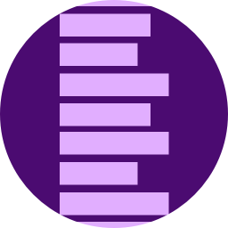

# HTTP2 Server Push plugin for Craft CMS 3.x

Automatically add HTTP2 Link headers for CSS, JS and image assets.



## Requirements

This plugin requires Craft CMS 3.0.0-beta.23 or later.

## Installation

To install the plugin, follow these instructions.

1. Open your terminal and go to your Craft project:

        cd /path/to/project

2. Then tell Composer to load the plugin:

        composer require superbig/craft3-http2serverpush

3. In the Control Panel, go to Settings → Plugins and click the “Install” button for HTTP2 Server Push.

## HTTP2 Server Push Overview

From [The Go Blog](https://blog.golang.org/h2push):
> To improve latency, HTTP/2 introduced server push, which allows the server to push resources to the browser before they are explicitly requested. A server often knows many of the additional resources a page will need and can start pushing those resources as it responds to the initial request. This allows the server to fully utilize an otherwise idle network and improve page load times._

Also: [Read what CloudFlare has to say about it](https://blog.cloudflare.com/announcing-support-for-http-2-server-push-2/).

## Configuring HTTP2 Server Push

```php
<?php
return [
    // Limit how many tags to include in the Link tag
    'limit'     => null,

    // Include images
    'includeImages' => false,
];
```

## Using HTTP2 Server Push

After the plugin is installed, Link headers will be added automatically to page template responses.

Brought to you by [Superbig](https://superbig.co)
